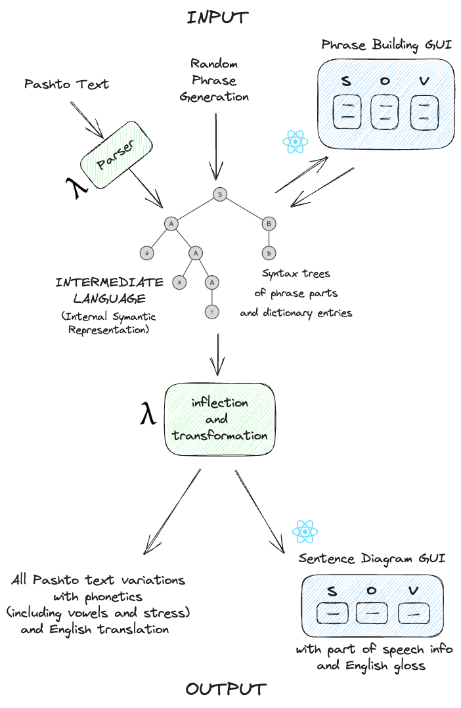
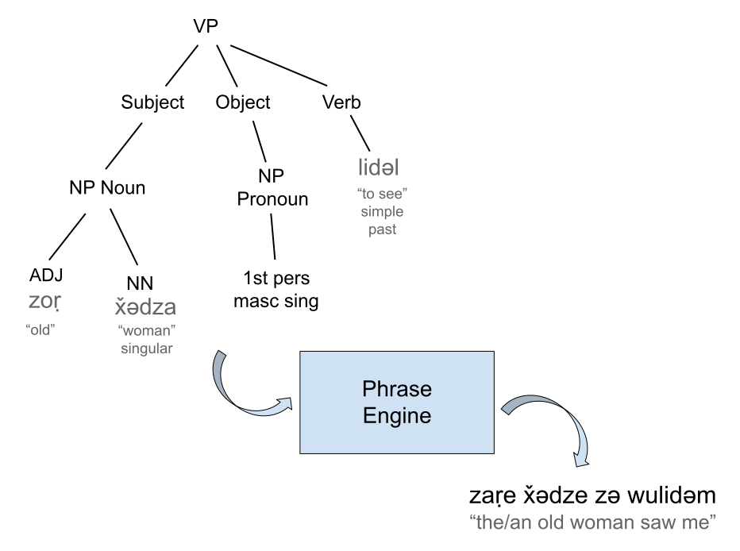

# pashto-inflector

[](https://www.gnu.org/licenses/gpl-3.0)
[](https://app.netlify.com/sites/pashto-verbs/deploys)


A pashto inflection, verb conjugation, and phrase-generation engine, as well as functions and components for modifying and displaying Pashto text.

#### [Pashto Inflector Website/Demo](https://pashto-inflector.lingdocs.com)



## How it works

This library uses a 3-step process to generate gramattically correct Pashto phrases. This 3-step process corresponds directly to Chomsky's tripartrite structure for tranformational generative grammars.

| | Pashto Inflector Function | Chomskian Grammar Level |
|-|--------------------------| ----------------------- |
|1.| Assemble the phrase tree | Phrase Structure Rules |
|2.| Inflect the words in tree | Morphophonemic Rules |
|3.| Arrange the inflected words in order | Transformational Rules |

### 1. Assemble the phrase tree

**Phrase Structure Rules**

An abstract syntax tree is created with the various parts of a phrase represented as dictionary entries of the words as well as information about gender, number, and tense, etc. These are arranged in typed structures that allow for arranging NP and APs into verbal or equative phrases.

### 2. Inflect all the words in the phrase tree

**Morphophonemic Rules**

The dictionary entries for the words are inflected and conjugated as necessary.

### 3. Arrange the inflected words

**Transformational Rules**

The inflected words are arranged into possible phrases with various options for dropping or encliticizing pronouns, and placing the negation particle in the correct place(s).


* The full process of phrase building

## Distributions

This is published on [a private NPM proxy registry](https://npm.lingdocs.com) as two libraries:

- @lingdocs/inflect
    - `/src/lib`
    - The core inflection engine with grammatical information and tools for processing LingDocs dictionary entries and Pashto text.
    - Can be used with Node 16, as CommonJS
- @lingdocs/ps-react
    - `/src/components`
    - @lingdocs/inflect plus react components for displaying Pashto text, phrase engine UI etc.
    - Only available as an ES6 Module

`@lingdocs/pashto-inflector` **is deprecated**. Use `@lingdocs/inflect` or `@lingdocs/ps-react` instead.

## Development

The Pashto Verb Explorer website can be used to view and play with the verb conjugations and various components. 

```
cd src/components
yarn install
cd ../lib
yarn install
cd ../..
yarn install
yarn start
```

## Building

⚠ Don't use `yarn build`. Use one of the commands below: ⚠

### Website

To build the [Pashto Verb Explorer](https://verbs.lingdocs.com) website:

```
yarn build-website
```

This outputs a site at `/build`

### Libraries

To build the `@lingdocs/inflet` and `@lingdocs/ps-react` libraries ready for publishing to NPM:

```
yarn build-library
```
